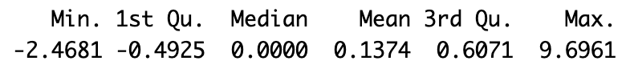

# A county-level spatial analysis of social capital in the United States
Spatial analysis of Social Capital and Community Heterogeneity at the United States County Level

Reference paper: [paper](xx) 


*Social capital*, defined as the resources or benefits received through one’s connections with others, contributes to economic efficiency, growth of communities, and population health. 

[Rupasingha et al. (2006)](https://www.sciencedirect.com/science/article/abs/pii/S1053535705000971) developed a high-quality, US county-level social capital index based on individuals’ participation in associational activities, trust, and civic engagement.

This measure, also known as the [Penn State index of social capital](https://aese.psu.edu/nercrd/community/social-capital-resources), is available for years 1990, 1997, 2005, 2009, and 2014.

Based on the definition outlined by Rupasingha et al., and by using free, publicly available, and reliable data, we generated a 2019 US county-level measure of social capital that can be employed in contemporary studies. 


## Section 1: Import data

The following variables have been used to generate the 2019 social capital index at the US county-level.

<p align="center">

</p>


```
df <- read.csv("sci_2019.csv")
```
<p align="center">

</p>

## Section 2: Generate the 2019 US county-level social capital index


SCI 2019 was generated by performing principal components analysis (PCA) on the four indicators of interest (i.e., aggregated associations, voter turnout, census participation, and nonprofit organizations), and the normalized first principal component was interpreted as the index of social capital. 
The resulting composite index is a quantitative measure of the relationship between the four indicators that explains the most variation in the data. 
To generate this composite index, we weighted all relevant associations equally; however, given the flexibility of the methodology, future modifications of this measure might incorporate different weighting schemes adapted to fit a specific research question in the future.

```
library(psych)
df$associations <- rowSums(df[,c("religion_imp","civic_imp","bowling_imp","fitness_imp","golf_imp","sport_imp",
                                 "business_imp","labor_imp","political_imp","professional_imp")])/df$population*10000/10
fit <- principal(df[,c("associations","vote","response","nccs")])
df$sci <- as.numeric(fit$scores) - median(as.numeric(fit$scores))
summary(df$sci)
```

<p align="center">

</p>

The index varies in the range of $[-2.5,9.7]$ centered on the median. 


## Section 3: Spatial distribution of the 2019 US county-level social capital index

```
library(geojsonsf)
counties  <- geojson_sf('counties.geojson')
counties$fips <- as.integer(counties$GEOID)
sp <- counties[counties$fips %in% df$fips,]
inner_join(counties, df, by = 'fips') -> df_sp 
df_sp = st_transform(df_sp, 3085)

library(tmap)
tm_shape(df_sp) + 
  tm_fill("sci",
          n = 5,
          style = "quantile",
          palette =  hcl.colors(15, "ArmyRose"),
          title = "SOCIAL CAPITAL INDEX 2019 \nQUANTILE MAP")  +
  tm_layout(legend.text.size = 1.15,
            legend.title.size = 1.2)+
  tm_borders(alpha=.9,lwd=0.3) +
  tm_scale_bar(position = c("center", "top"), text.size=0.7) 
```

<p align="center">

</p>

Higher (positive) values of social capital are concentrated in the upper Midwest and Northwest counties, whereas lower index (negative) values are concentrated in the Southeast/Southwest counties.
