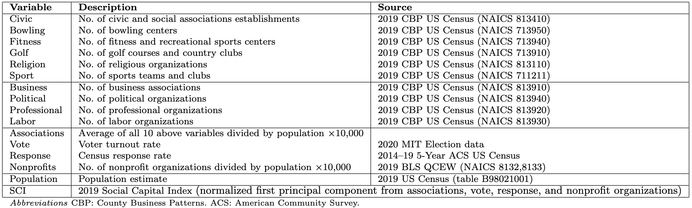
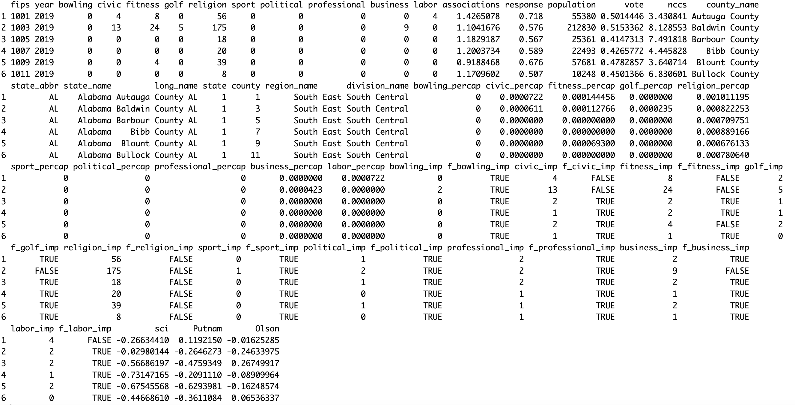
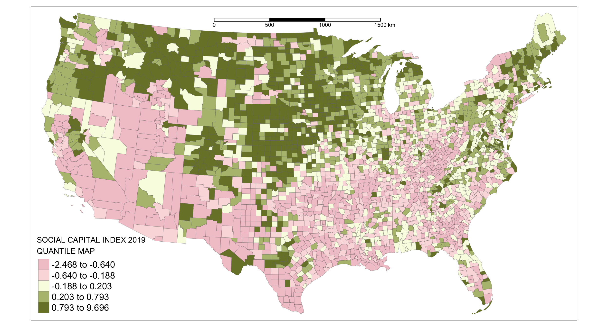

# A county-level spatial analysis of social capital in the United States
Spatial analysis of Social Capital and Community Heterogeneity at the United States County Level

Reference paper: [paper](xx) 


## Section 1: Import data

```
df <- read.csv("sci_2019.csv")
```


## Section 2: Generate the 2019 US county-level social capital index

The following variables have been used to generate the
2019 social capital index at the US county-level based on the definition of
social capital from [Rupasingha et al.](https://www.ncbi.nlm.nih.gov/pubmed/28823158), also known as the Penn State index
of social capital.

<p align="center">

</p>


```
library(psych)
df$associations <- rowSums(df[,c("religion_imp","civic_imp","bowling_imp","fitness_imp","golf_imp","sport_imp",
                                 "business_imp","labor_imp","political_imp","professional_imp")])/df$population*10000/10
fit <- principal(df[,c("associations","vote","response","nccs")])
df$sci <- as.numeric(fit$scores) - median(as.numeric(fit$scores))
df$Putnam <- rowSums(df[,c("religion_imp","civic_imp","bowling_imp","fitness_imp","golf_imp","sport_imp")])/df$population*10000/6
df$Putnam <- as.numeric(df$Putnam) - median(as.numeric(df$Putnam))
df$Olson <- rowSums(df[,c("business_imp","labor_imp","political_imp","professional_imp")])/df$population*10000/4
df$Olson <- as.numeric(df$Olson) - median(as.numeric(df$Olson))
head(df)
```
<p align="center">

</p>

## Section 3: Spatial distribution of the 2019 US county-level social capital index

```
library(geojsonsf)
counties  <- geojson_sf('counties.geojson')
counties$fips <- as.integer(counties$GEOID)
sp <- counties[counties$fips %in% df$fips,]
inner_join(counties, df, by = 'fips') -> df_sp 
df_sp = st_transform(df_sp, 3085)

library(tmap)
tm_shape(df_sp) + 
  tm_fill("sci",
          n = 5,
          style = "quantile",
          palette =  hcl.colors(15, "ArmyRose"),
          title = "SOCIAL CAPITAL INDEX 2019 \nQUANTILE MAP")  +
  tm_layout(legend.text.size = 1.15,
            legend.title.size = 1.2)+
  tm_borders(alpha=.9,lwd=0.3) +
  tm_scale_bar(position = c("center", "top"), text.size=0.7) 
```

<p align="center">

</p>

The index varies in the range of $[-2.5,9.7]$ centered on the median. Higher (positive) values of social capital
are concentrated in the upper Midwest and Northwest counties, whereas lower index (negative) values are concentrated in the Southeast/Southwest counties.
